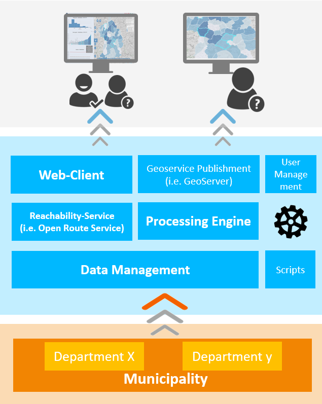

# KomMonitor DataManagement REST API

This projects implements a REST API that persists and manages all relevant data within the KomMonitor project.

## Background Information Concerning KomMonitor Spatial Data Infrastructure
This software is part of a spatial data infrastructure called [KomMonitor](http://kommonitor.de), which is a shortcut for German "Kommunales Monitoring" (Municipal monitoring). Funded by the <i>German Federal Ministry of Education and Research</i> municipal actors from the cities Essen and Mülheim cooperate with scientists from the Ruhr University Bochum and the Bochum University of Applied Sciences in order to create a monitoring infrastructure to support planning processes within local governments. I.e., by monitoring certain planning aspects from various topics like demography, social, environment, habitation and other, whose spatio-temporal variation and development can be measured in the form of indicators, [KomMonitor](http://kommonitor.de) may act as a <i>Spatial Decision Support System</i>. Amongst others, the following goals and key aspects are focused:
1. cross-sectional data from several topics
2. variable spatial layers (i.e. administrative layers of a city)
3. transparency with regard to indicators and how they are computed
4. cross-sectional interactive analysis and exploration
5. a complete spatial data infrastructure consisting of data management, geodata processing and indicator computation as well as data display and exploration in webclient

The project is funded from Feb 2017 - Feb 2020. The resulting software components, are published as Open-Source software to continue maintenance and development beyond the funding period.

### Architecture Overview


As a spatial decision support system, the main idea behind KomMonitor is to take (geo-)data from local authorities, import them to the <i>Data Management</i> component, process them (i.e. compute indicators based on georesurces and maybe other indicators via the <i>Processing Engine</i>; or compute waypath routing and reachability isochrones via <i>Reachability Service</i>) and finally publish, display and analyze them within a <i>Web-Client</i>.     

## Overview  
The <b>KomMonitor Data Management API</b> is a REST API encapsulating data management CRUD operations for various resources, such as spatial units, other georesources, indicators, topics, users and user groups, roles and custom indicator computation scripts. These resources are managed in a PostGIS database and serve as the basis for other components of the [KomMonitor](http://kommonitor.de) spatial data infrastructure.

For each resource dedicated REST operations are specified using [Swagger/OpenAPI v2](https://swagger.io). The corresponding ```swagger.json``` containing the REST API specification is located at ```src/main/resources/swagger.json```. To inspect the REST API you may use the online [Swagger Editor](https://editor.swagger.io/) or, having access to a running instance of the <b>KomMonitor Data Management REST API</b> simply navigate to ```<pathToDeyployedInstance>/swagger-ui.html```, e.g. ```localhost:8085/swagger-ui.html```.

The service is implemented as a Java Spring Boot REST service. In addition [Maven](https://maven.apache.org/) is used as dependency and build management tool.

## Installation / Building Information
Being a Maven project, installation and building of the service is as simple as calling ```mvn clean install``` or ```mvn clean package```. Even Docker images can be acquired with ease, as described below. However, depending on your environment configuration aspects have to be adjusted first.

### Configuration
Configuration distinguishes between two main categories.
1. Configuring database access and deployment details of other components
2. Configuring target build format (single executable <b>JAR</b> file or classic <b>WAR</b> container).

#### application.properties - Configure Database Access and Deployment Details of other Services
The central configuration file is located at ```src/main/resources/application.properties```. Several important aspects must match your target environment when deploying the service. These are:

- name and port:
```
server.port=8085
spring.application.name=kommonitor-data-access-api
```
- database connection (to PostGIS database):
```
spring.jpa.database-platform=org.hibernate.dialect.PostgreSQL9Dialect
spring.datasource.driverClassName=org.postgresql.Driver
# adjust following parameters to your target environment
spring.datasource.url= jdbc:postgresql://localhost:5432/kommonitor_midterm
spring.datasource.username=postgres
spring.datasource.password=postgres
database.host=localhost
database.port=5432
database.name=kommonitor_midterm
```
- GeoServer connection (optional - it can be disabled):
```
# properties for geoserver connection
# true enables geoserver publishment; false will disable it
ogc.enable_service_publication = false;
# connection details to your running GeoServer incl. credentials
rest.url=http://localhost:8080/geoserver
rest.user=admin
rest.password=geoserver
# target workspace and datastore names for respective features
workspace=kommonitor
datastore_spatialunits=kommonitor_spatialunits
datastore_georesources=kommonitor_georesources
datastore_indicators=kommonitor_indicators
defaultEPSG=EPSG:4326
```

After adjusting the configuration to your target environment, you may continue to build the service as described next.

#### JAR / WAR File
##### JAR
As a Spring Boot application the typical build format is a single runnable <b>JAR</b>, which is also set as project default. Simply run the command `mvn clean install` or `mvn clean package` to create the runnable JAR file within the <b>target</b> folder. To run the JAR locally, simply call `start java -Dfile.encoding=utf-8 -jar kommonitor-data-management-api-1.0.0.jar` from the target directory of the project, which will serve the application at `localhost:<PORT>` (i.e. `localhost:8085` per default). In a browser call  ``localhost:<PORT>/swagger-ui.html`` to inspect the REST API.

##### WAR
However, you might need to create a WAR archive in some scenarios. To create a WAR archive, following the [Baeldung Guide](https://www.baeldung.com/spring-boot-war-tomcat-deploy), you must adjust the associated settings in `pom.xml` file:

1. Look for the `<packaging>JAR</packaging>` setting and change it to `<packaging>WAR</packaging>`
2. Look for the follwing commented out dependency
```
<!-- <dependency>
    <groupId>org.springframework.boot</groupId>
    <artifactId>spring-boot-starter-tomcat</artifactId>
    <scope>provided</scope>
</dependency> -->
```
and enable it by removing the comment characters
```
<dependency>
    <groupId>org.springframework.boot</groupId>
    <artifactId>spring-boot-starter-tomcat</artifactId>
    <scope>provided</scope>
</dependency>
```
3. The entry point of the service located at `src/main/java/de/hsbo/kommonitor/datamanagement/Runner.java` already implements the required <i>SpringBootServletInitializer</i> interface. <u>Hence you must not change anything here</u>.
```
package de.hsbo.kommonitor.datamanagement;
import org.springframework.boot.SpringApplication;
import org.springframework.boot.autoconfigure.SpringBootApplication;
import org.springframework.boot.autoconfigure.domain.EntityScan;
import org.springframework.boot.web.servlet.support.SpringBootServletInitializer;
import org.springframework.context.annotation.ComponentScan;
@SpringBootApplication
@ComponentScan("de.hsbo.kommonitor")
@EntityScan( basePackages = {"de.hsbo.kommonitor"} )
public class Runner extends SpringBootServletInitializer{

    public static void main(String[] args) {
        SpringApplication.run(Runner.class, args);
    }
}
```

After these adjustments you can run the command `mvn clean install` or `mvn clean package`, which will create the corresponding <b>WAR</b> file in the folder <b>target</b>. Deploy it somewhere, e.g. in Tomcat, to launch the app. Assuming the WAR file is named `kommonitor-data-management-api-1.0.0.WAR` and Tomcat is started locally on port 8080, you may reach the service via `localhost:8080/kommonitor-data-management-api-1.0.0`. In a browser call  ``localhost:8080/kommonitor-data-management-api-1.0.0/swagger-ui.html`` to inspect the REST API.

### Docker
The <b>KomMonitor Data Management REST API</b> can also be build and deployed as Docker image. The project contains the associated `Dockerfile` and an exemplar `docker-compose.yml` on project root level. The `Dockerfile` already expects a pre-built <b>JAR</b> file of the service. So, before building the docker image, you must build the runnable <b>JAR</b> via maven.

When building the docker image (i.e. `docker build -t data-management-api:latest .`), the profile `docker` is used. In contrast to the default profile, the `docker` profile consumes the associated `src/main/resources/application-docker.properties`, which makes use of environment variables to declare relevant settings (as described in the [Configuration](#configuration) section above). For instance check out the exemplar [docker-compose.yml](./docker-compose.yml) file. It specifies two services, `kommonitor-db` as required PostGIS database container and the actual `kommonitor-data-management-api` container. The latter depends on the database container and contains an `environment` section to define the required settings (connection details to other services etc.).

A more advanced setup including a Geoserver as docker container is also given at [docker-compose_managementAndGeoserver.yml](./docker-compose_managementAndGeoserver.yml).

## User Guide
TODO

## Contribution - Developer Information
This section contains information for developers.

### How to Contribute
The technical lead of the whole [KomMonitor](http://kommonitor.de) spatial data infrastructure currently lies at the Bochum University of Applied Sciences, Department of Geodesy. We invite you to participate in the project and in the software development process. If you are interested, please contact any of the persons listed in the [Contact section](#contact):

### Branching
The `master` branch contains latest stable releases. The `develop` branch is the main development branch that will be merged into the `master` branch from time to time. Any other branch focuses certain bug fixes or feature requests.

### License and Third Party Lib POM Plugins
According to [52°North Best Practices for Java License Management](https://wiki.52north.org/Documentation/BestPracticeLicenseManagementInSoftwareProjects) the POM contains following plugins

 - license-maven-plugin by mycila (used to check and generate license headers for source code files)
    - ```mvn license:check```
    - ```mvn license:format```
 - maven-license-plugin by codehaus (used to generate an overview of Third Party dependencies as THIRD-PARTY.txt)
    - ```mvn clean generate-resources``` (creates file under target/generated-resources/license/THIRD-PARTY.txt)
 - maven-notice-plugin (used to create and maintain a NOTICE file containing a short list of third party dependencies)   
    - ```mvn notice:check``` (checks whether NOTICE file exists and is up-to-date)
    - ```mvn notice:generate``` (generates NOTICE file based on POM dependencies)

Note that project build may fail if any of the configured prerequisits according to these plugins is not fulfilled.

## Contact
|    Name   |   Organization    |    Mail    |
| :-------------: |:-------------:| :-----:|
| Christian Danowski-Buhren | Bochum University of Applied Sciences | christian.danowski-buhren@hs-bochum.de |
| Andreas Wytzisk  | Bochum University of Applied Sciences | Andreas-Wytzisk@hs-bochum.de |
| Ulrike Klein | Bochum University of Applied Sciences | christian.danowski-buhren@hs-bochum.de | Ulrike.Klein@hs-bochum.de |

## Credits and Contributing Organizations
- Department of Geodesy, Bochum University of Applied Sciences
- Department for Cadastre and Geoinformation, Essen
- Department for Geodata Management, Surveying, Cadastre and Housing Promotion, Mülheim an der Ruhr
- Department of Geography, Ruhr University of Bochum
